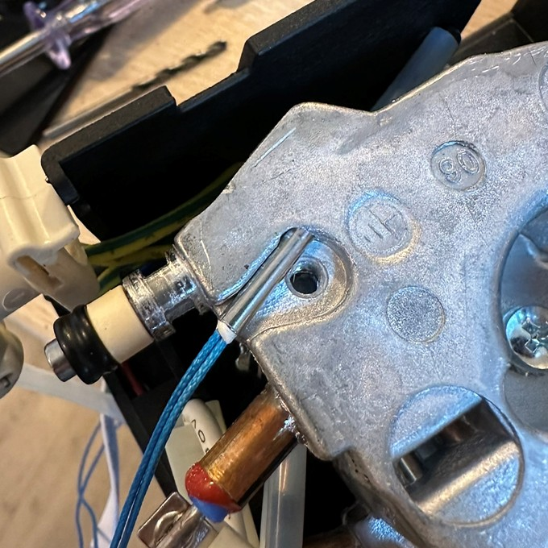
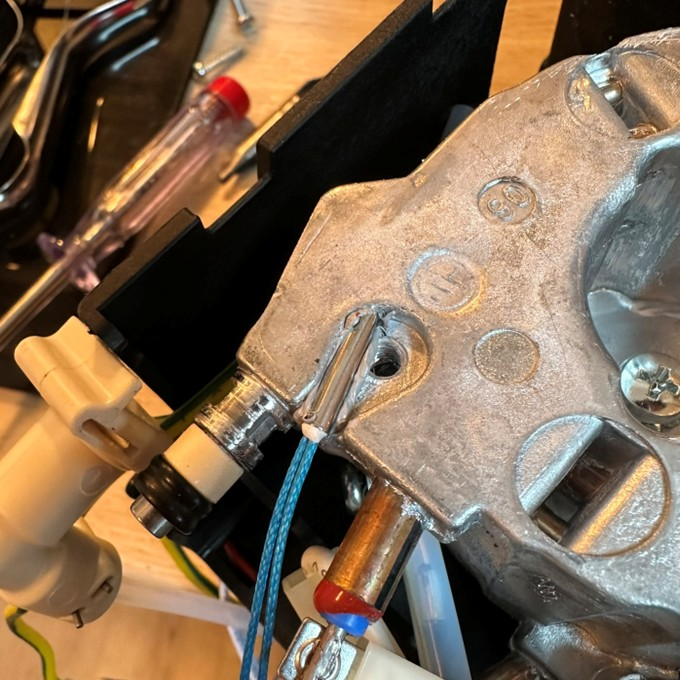
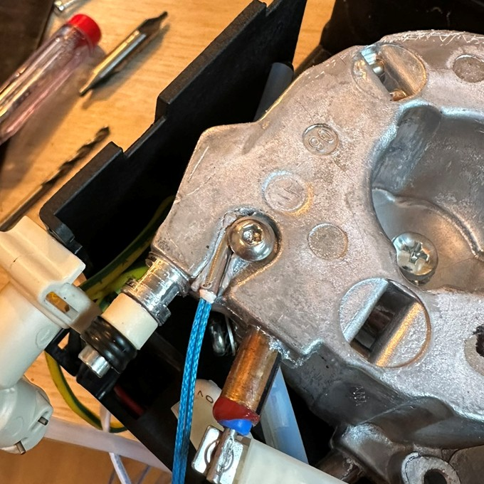

# Espresso Machine Display – Arduino Nano Project

With this project, you can monitor and visualize the coffee brewing and extraction process by installing a pressure sensor and a temperature sensor. No modifications are made to the machine’s electronics — it is purely a non-invasive monitoring and display system shown on a small screen. This helps in determining the optimal grind size and coffee dose.

For installation, you only need to disconnect the silicone hose between the thermoblock and the outlet. This hose is available as a spare part, so the machine can be fully restored to its original condition at any time. The display is designed in a way that no drilling is required — it uses the original mounting holes of the logo badge.

The system is based on an Arduino Nano with its own power supply. It can be connected without any soldering or modifications to the original circuit board.

---

## ✨ Features

- **Non-invasive monitoring**: The machine remains unmodified — no soldering to the maschine electronic, no drilling, and 100% reversible installation.
- **Real-time shot timer**: Accurately displays extraction duration from the moment the pressure is high enough and the extraction starts.
- **Pressure measurement**: Displays current and maximum brewing pressure during extraction, afterwards maximum and average pressure.
- **Temperature display**: Shows current heater block temperature while brewing, afterwards maximum and average temperature.
- **Post-shot analysis**: After extraction, the display shows average & maximum pressure and temperature values.
- **OLED display**: Compact 128x64 I2C screen for clear and minimalistic visualization.
- **Standalone system**: Powered by mini 12V power supply, does not interfere with the machine’s electronics.
- **3D-printed mounting**: Reuses existing logo mounting holes — no drilling required.

---

## 📦 Bill of Materials (BOM)

| **Component**                                   | **Quantity** | **Specification**                                              | **Link**                    |
|--------------------------------------------------|--------------|----------------------------------------------------------------|-----------------------------|
| **Arduino Nano**                                 | 1            | Microcontroller                                                 | [Arduino Nano – Arduino Store](https://store.arduino.cc/products/arduino-nano) |
| **OLED Display**                                 | 1            | 0.96" I2C OLED Display, 128x64                                  | [DIYmall 0.96" OLED Display – Amazon](https://www.amazon.com/DIYmall-Serial-128x64-Display-Arduino/dp/B00O2KDQBE) |
| **Resistor (100kΩ)**                             | 1            | 100kΩ, 1/4W                                                     | [100kΩ Resistor 20-pack – LED-Shop](https://www.led-shop.com/Widerstand-1-4W-100k-Ohm-20er-Pack) |
| **Thermistor (ATC Semitec 104GT-2)**             | 1            | 100kΩ @ 25°C (NTC)                                              | [JINXIUS 104GT-2 Thermistor – Amazon](https://www.amazon.com/JINXIUS-Temperature-104NT-4-R025H42G-Thermistor-Compatible/dp/B097PBSQYZ) |
| **Pressure Sensor G1/4" (DC 5V)**                | 1            | Stainless steel, 0–300 PSI, analog output                       | [Pressure Transmitter G1/4" – Amazon](https://www.amazon.de/Drucktransmitter-Analogsensor-Wasser-Luftkompressor-0-300/dp/B0DPQTX1JR) |
| **T-Connector G1/4"-4mm, IQS-MSV**               | 1            | G1/4" female thread, 4mm hose connector                         | [T-Connector IQS-MSV – Landefeld](https://www.landefeld.de/artikel/de/t-steckanschluss-g-14-4mm-iqs-msv-standard-/IQST%20144%20G%20MSV) |
| **Hailege 5pcs NANO IO Shield DIY Kit**          | 1            | DIY kit for Arduino Nano (5 pieces)                             | [Hailege Nano IO Shield – Amazon](https://www.amazon.com/Hailege-Shield-Expansion-Board-Arduino/dp/B08D7D8NPL) |
| **Cables**                                       | -            | Various lengths                                                 | |
| **WAGO 2-pin Lever Connector**                   | 2            | -                                                               | [WAGO 2-pin Connector](https://www.wago.com/de/installationsklemmen/verbindungsklemme-mit-hebeln/p/221-412) |
| **Screws M2.5x12mm**                             | 2            | M2.5, length: 12mm                                              | [M2.5x12mm Screws – Amazon](https://www.amazon.de/Innensechskant-Au%C3%9Fengewinde-Edelstahl-Anti-Lose-Maschinenbefestigungen-M2-5x12mm/dp/B0BJPLYXK1) |
| **Screw M3x12mm**                                | 1            | M3, length: 12mm                                                | [M3x12mm Screw – Amazon](https://www.amazon.de/dp/B08BL9PK4N) |
| **M2.5 Thread Inserts / T-nuts**                 | 2            | M2.5                                                            | [M2.5 Thread Inserts / T-nuts](https://www.ahltec.de/shop/de/M2-5-Gewindeeinsaetze--Einschlagmuttern-438.html) |
| **Power Supply Option 1 (EPLZON 12V)**           | 1            | EPLZON 12V/DC 6W Mini LED Transformer                           | [EPLZON 12V Power Supply – Amazon](https://www.amazon.de/EPLZON-Transformator-Leuchten-Stripes-Mindestlastanforderungen/dp/B0DQNP4Z2S) |
| **Power Supply Option 2 (Meanwell IRM-03-12S)**  | 1            | Meanwell IRM-03-12S, 12V DC, 3W                                 | [Meanwell IRM-03-12S – Mouser](https://www.mouser.de/ProductDetail/MEAN-WELL/IRM-03-12S?qs=NKmfXavxMaxrQLjk4RvqlA%3D%3D) |
| **Piggyback Spade Connector**                    | 2            | Spade connector with additional branch (e.g., 6.3 mm)           | [Piggyback Spade Connector 6.3 mm – Amazon](https://www.amazon.de/-/en/10-Piggy-Backs-5mm%C2%B2-6-red/dp/B005J4QMLI) |
| **Thermal Paste**                                | 1            | Standard CPU-compatible thermal paste                           | [ARCTIC MX-4 Thermal Paste – Amazon](https://www.amazon.de/dp/B0795DP124) |

replacement hose: https://komtra.de/delonghi-ersatzteile/delonghi-ersatzteile/schlauch-l230-mm-klemmverbindung-klemmverbindung.html

---

## 🔧 Wiring Diagram & Setup Instructions

### 🖥️ OLED Display (I2C)
- **SDA** → Arduino **A4**
- **SCL** → Arduino **A5**
- **GND** → Arduino **GND**
- **VCC** → Arduino **5V**

### 🌡️ Thermistor (ATC Semitec 104GT-2) & Voltage Divider
- **Thermistor**:
  - One end → Arduino **5V**
  - Other end → Arduino **A1**
- **100kΩ Resistor**:
  - One end → Arduino **A1**
  - Other end → Arduino **GND**

### 📈 Pressure Sensor
- **VCC** → Arduino **5V**
- **GND** → Arduino **GND**
- **SIGNAL** → Arduino **A0**

### ⚡ Power Supply via Piggyback Connector
- **The power supply is connected to the board via a piggyback connector**
- **Positive lead (+)** from power supply → Arduino **VIN**
- **Ground (−)** from power supply → Arduino **GND**

> ⚠️ **Note**: When powering the Arduino externally, use the **VIN pin**, not the 5V pin. Ensure **GND is shared** across all components for proper reference voltage.
  
---

## 🧑‍💻 Installation
## 🖥️ **Upload Firmware Using the Arduino IDE**

Follow these steps to upload the firmware to your Arduino using the `.hex` files provided in this repository.

### 1. **Download the firmware file**:
   - Download the **`dedicioni.ino.with_bootloader.hex`** file from the `/firmware` folder in this repository

### 2. **Open the Arduino IDE**:
   - Launch the **Arduino IDE** on your computer.

### 3. **Select the correct board and port**:
   - Go to **Tools** → **Board** and select your Arduino model (e.g., Arduino Uno).
   - Go to **Tools** → **Port** and select the COM port your Arduino is connected to.

### 4. **Upload the firmware**:
   - Click on **Sketch** → **Upload Using Programmer**.
     - If prompted, make sure the programmer is set to **"Arduino as ISP"** (or the programmer you are using).

### 5. **Select the `.hex` file**:
   - In the file dialog that appears, navigate to the `.hex` file you downloaded earlier.
   - Select the file and click **Open**.

### 6. **Wait for the upload to finish**:
   - Once the upload process is completed, your board will automatically start running the new firmware!

---

## 🖨️ 3D Printing the Enclosure

For this project, I designed a custom enclosure that can be made using FDM 3D printing.      

1. **Download the 3D Model:**
   - The 3D model for the enclosure is available on **Printables**. You can download it directly from
     https://www.printables.com/model/1214912-delonghi-dedica-ec885-ec685-modification-display/files

2. **Printing Settings:**
   - **Material:** ASA, ABS or PETG 
   - **Layer Height:** 0.2 mm (standard for good quality).
   - **Infill:** 20–30% (enough for stability without wasting too much material).
   - **Supports:** is needed, you should place the display holder flat on the front side
   - **Brim:** is needed if you print with ASA or ABS
   - **Fuzzy skin:** is optional

### 🔩 **Assembly of the Enclosure:**
- **Screws:** The enclosure uses **M2.5x12mm screws** (included in the Bill of Materials) to securely attach the components.
- **Assembly:**
1. Remove the DeLonghi emblem by using pliers to detach the clips from the inside. Afterward, the emblem can be removed.
2. The remaining holes on the left and right will be used as mounting points in conjunction with the M2.5 insert nuts. The nuts will be glued from the inside using some CA glue.
3. Pass the 4-wire display cable through the middle large hole from the outside.
4. Screw in the M2.5 screws loosely.
5. Slide the display through the display mount from the back. It was specifically designed so that the display fits perfectly.
6. Hang the mount onto the screws and then lightly tighten the screws from the front through the mount. The screws do not require high tightening torque.
7. Place the display onto the mount and clip the display cover onto the front. The display cover holds the display in place without any glue needed.

---

## 🌡️ Mounting the Temperature Sensor

The temperature sensor (NTC thermistor type 104GT-2) is attached directly to the thermoblock with an M3x12mm screw to provide accurate temperature readings during the extraction process.
I found a position where it's not needed to drill a hole. The hole is already there and the material of the thermoblock is so soft that it's not needed to cut a thread before. Ofcourse it's better to cut the thread with an M3 thread cutting tool. Be careful.

### 🛠️ Steps:

1. **Access the thermoblock**  
   I will upload a video of the whole process in the near future.

2. **Cut the thread**  
   Using an M3 thread cutting tool is the best option.  
   It is also possible to use the screw itself, but be careful!  
   Gently screw in the screw with small back-and-forth movements. During this process, the screw needs some axial pressure.  
   Make sure that the screw is screwed in straight.

3. **Optional: file/sand a hollow for a better fit of the temperature sensor**  
   For better contact and more accurate temperature readings, you can use a 3mm reamer to create a better fit between the temperature sensor and the heater block.  
   This step is not necessary.

4. **Apply thermal paste**  
   Apply thermal paste to the temperature sensor and to the heater block.  
   Simply wipe off any excess paste after mounting the sensor and tightening the screw.  

5. **Route the cable**  
   Guide the thermistor cable down to the electronic board, avoiding sharp edges or tight bends. Connect it to the Arduino as described in the **Wiring Diagram** section.

### 🔁 Reversibility

All steps are 100% reversible — the machine can be restored to its original condition at any time since no permanent modifications are made.
---

## 📸 Photos
_Images of the mounted system go here_

---

## 📺 Demo Video
YouTube: https://youtu.be/2GCKHqg131g?feature=shared
         https://youtube.com/shorts/OjNCzPk4PEM?feature=shared
         https://youtube.com/shorts/8p8zOG2kiDQ?feature=shared

---

## ⚖️ License
This project is licensed for **private, non-commercial use only**.  
See `LICENSE` for details or contact the author for other use cases.

---

## 🤝 Contributing
Feel free to open issues or submit pull requests!

---
## 💖 Support

If you find this project helpful and would like to support its development, consider buying me a coffee:

Thank you for your support! ☕😊

---

##  ⚠️ **Warning / Disclaimer**

- This project involves working with high voltage and mechanical components. Improper handling may lead to electric shock, injury, or damage to the equipment.
- Modifying your machine will likely void any manufacturer warranty.
- You are responsible for any risks or consequences. Proceed only if you have experience with electronics and high-voltage systems.
